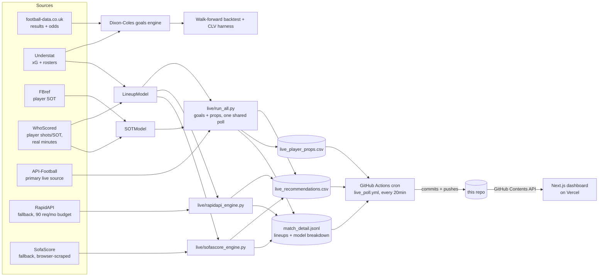

# ⚽ footymodel

[](https://footymodel.vercel.app/)


A stats-first football betting research project: does **positive expected
value (ROI) vs. bookmaker closing odds** exist anywhere in these markets, and
if so, where exactly? Not "does this predict football well" — a model can be
accurate and still lose money once the market's own margin is priced in.

Every claimed edge here has been walk-forward backtested (never trained on
future data) and calibration-checked before being trusted. Most markets
tested show **no edge**, and that's reported just as loudly as the ones that
do — see [Results at a glance](#results-at-a-glance) and the full
[`RESULTS.md`](RESULTS.md).

## Live dashboard

**[footymodel.vercel.app](https://footymodel.vercel.app/)**
— the public-facing view of the live paper-trade pipeline below. Five tabs:
**Track record** (graded results vs. real scores), **Goals O/U** (upcoming
confirmed-lineup predictions, click a match to expand the team-model vs.
lineup-model breakdown, confidence read, and starting XI), **Player props**
(shots / shots-on-target), **Staking** (Kelly bankroll simulation), and
**Glossary** (every term on the other tabs explained). Auto-refreshes as new
predictions land; no login, nothing to configure.

## Table of contents

- [Live dashboard](#live-dashboard)
- [Results at a glance](#results-at-a-glance)
- [Core idea](#core-idea)
- [Architecture](#architecture)
- [Layout](#layout)
- [Setup](#setup)
- [Phase 1 usage](#phase-1-usage)
- [Betting tool — weekly workflow (Over/Under)](#betting-tool--weekly-workflow-overunder)
- [Phase A — lineup-aware model](#phase-a--lineup-aware-model-confirmed)
- [Phase B — live pipeline](#phase-b--live-pipeline-detection--paper-trade-not-execution)
- [Checking performance once real data is logged](#checking-performance-once-real-data-is-logged)
- [Roadmap](#roadmap)
- [Testing](#testing)
- [License](#license)

## Results at a glance

| Market / feature | Verdict | Key number |
|---|---|---|
| Over/Under, 1X2 (goals model) | ❌ No edge | CLV ≈ −0.2%, yield ≈ −7% |
| Asian Handicap (all 7 leagues) | ❌ No edge | best config +2.05% yield but −1.52% CLV — the "positive yield, negative CLV" noise trap |
| Lineup-aware total-goals accuracy | ✅ Confirmed | pooled t = 3.04 across all big-5 leagues |
| Lineup-edge → live profit | 🔴 Live now | paper-trading since the season kicked off — see the [dashboard](#live-dashboard)'s Track record tab for the running total, not hardcoded here since it changes every match |
| Player shots/SOT calibration | ✅ Well-calibrated | gaps mostly within ±0.03, full PL + Bundesliga seasons |
| Player shots/SOT → live profit | 🔴 Live now | forward paper-trade only (no historical prop-odds archive exists to backtest against) — see the dashboard's Player props tab |

Full detail, per-league tables, and every rejected hypothesis (rest-days,
mid-tier lineup extension, etc.) are in [`RESULTS.md`](RESULTS.md).

## Core idea

Betting favorites gives a high hit rate and negative returns. We optimize for
**edge vs. the bookmaker's margin-stripped ("fair") probability**. Profit comes
from calibration + value detection + staking discipline, on top of a principled
statistical core (Dixon-Coles / Poisson).

## Architecture



All three live engines write to the SAME `live_recommendations.csv`, tagged
by source — API-Football is primary, RapidAPI and SofaScore exist as
fallbacks so a single provider's outage (API-Football's free tier has been
suspended before) doesn't stop predictions from being logged. The whole
thing runs unattended on a GitHub Actions cron, not a local machine — the
dashboard reads straight from the repo, so there's no separate database or
backend server.

## Layout

```
footymodel/
  config.py    # leagues, seasons, data source URLs, column maps
  data.py      # Phase 1 — download + normalize football-data.co.uk CSVs
  players.py   # Phase A — LineupModel (confirmed-lineup goals prediction)
  live/        # Phase B — live detection/paper-trade pipeline
    engine.py            # API-Football goals/O-U engine (primary)
    rapidapi_engine.py    # RapidAPI fallback (100 req/month, budget-capped)
    sofascore_engine.py   # SofaScore fallback (browser-scraped, no API key)
    match_detail.py        # shared JSONL side-log: lineups + model breakdown
    run_all.py             # shares one fetch across goals + props engines
    grade_results.py       # grades logged predictions against real results
    shots_engine.py         # player shots/SOT props engine
dashboard/    # Next.js app (Vercel) — the public-facing live view, see below
data/
  raw/         # downloaded CSVs (gitignored)
  processed/   # normalized tidy tables + live logs (mostly gitignored,
               # tracked exceptions listed in .gitignore for the cron to
               # commit back to the repo)
```

## Setup

```bash
cd ~/footymodel
python3 -m venv .venv
. .venv/bin/activate
pip install -r requirements.txt
```

## Phase 1 usage

```bash
. .venv/bin/activate
python -m footymodel.data              # download + normalize default leagues/seasons
python -m footymodel.data --leagues E0 E1 N1 --seasons 2021 2022 2023 2024
```

Output: `data/processed/matches.parquet` — one tidy row per match.

## Betting tool — weekly workflow (Over/Under)

The recommender fits the model on all history and outputs O/U value bets with
fractional-Kelly stakes for upcoming fixtures, logging them for paper-trading.

```bash
. .venv/bin/activate
# Demo on the latest matchday in the dataset (grades vs actual results):
python -m footymodel.recommend --league E1

# Live use next season — supply current fixtures + odds:
#   fixtures.csv columns: home_team,away_team,odds_over25,odds_under25
python -m footymodel.recommend --league E1 --fixtures fixtures.csv
```

Every run appends to `data/processed/paper_trades.csv`. Team names must match
football-data.co.uk spellings (e.g. "Sheffield United", "Nott'm Forest").

> **HONEST STATUS.** The goals/xG statistical model shows **no edge** vs. the
> market (`RESULTS.md`): O/U yield ~−7%, CLV ~−0.2%. The one confirmed
> exception is the **lineup-aware model** (Phase A below) — knowing the
> actual starting XI (attack + defence) measurably improves O/U prediction
> accuracy, replicated significantly across all 5 big-5 leagues (pooled
> t=3.04). That edge is now live paper-trading — see Phase B and the
> [dashboard](#live-dashboard).

## Phase A — lineup-aware model (CONFIRMED)

`players.py`'s `LineupModel` predicts total goals from the actual starting XI
(both attack AND defence ratings, not team averages) using scraped Understat
per-match rosters. This is the single model improvement that has held up under
rigorous cross-league testing in this project — see `RESULTS.md` for the full
big-5 confirmation (every league improved in the same direction, unlike an
earlier half-built version that didn't replicate).

```bash
python -m footymodel.understat                    # already run — big-5 xG cached
python scripts/build_players.py E0,SP1,D1,I1,F1    # scrape rosters (slow, cached)
python scripts/lineup_test.py E0,SP1,D1,I1,F1      # reproduce the t=3.04 confirmation
```

## Phase B — live pipeline (detection / paper-trade, not execution)

The closing line already prices lineups, so Phase A's edge can't be captured
in a backtest — it can only exist in the **live window** right after lineups
are confirmed (~20–40 min pre-kickoff) and before bookmakers re-price.
`footymodel/live/` watches upcoming big-5 fixtures, detects confirmed
lineups, runs the exact same `LineupModel` used in the confirmed backtest,
fetches best-price O/U odds, and logs a timestamped recommendation.
**No staking, no order placement — detection/paper-trade only.**

### Three data sources, one goal

- **`engine.py` (API-Football, primary)** — the main source. Free tier is
  100 req/day; has been suspended once before without warning, which is why
  the other two exist.
- **`rapidapi_engine.py` (fallback)** — heuristic-confirmed lineups (no
  documented confirmed/predicted flag on this API), hard-capped at 90 of its
  100 requests/month to leave headroom.
- **`sofascore_engine.py` (fallback)** — no API key, no documented quota;
  scrapes SofaScore's internal API via a real headless-browser session
  (plain HTTP requests get bot-detected). **Currently blocked from GitHub
  Actions specifically** — SofaScore's bot-detection flags GitHub's shared
  runner IPs (confirmed: works fine from a residential IP, 403s only from
  the cron) — a known, tracked gap, non-blocking since it's a third-string
  fallback and the other two sources are healthy.

All three log to the same `data/processed/live_recommendations.csv`, tagged
by `source`, plus `data/processed/match_detail.jsonl` (starting XI names and
a team-model vs. lineup-model breakdown, consumed by the dashboard's
expandable match cards).

### Running it — production is GitHub Actions, not a local cron

Production polling is [`.github/workflows/live_poll.yml`](.github/workflows/live_poll.yml):
every 20 minutes, 9:00–21:59 UTC (covering kickoffs across PL/La
Liga/Bundesliga/Serie A/Ligue 1), it runs all three engines and commits+pushes
any new rows straight to this repo — no server, no local machine needs to
stay on. `run_all.py` drives the API-Football goals + player-props engines
off ONE shared fixtures+lineups fetch (see Phase H in the Roadmap for why
that matters on a 100-req/day free tier); the other two engines run as
separate steps in the same workflow.

To run any engine manually (e.g. local debugging):
```bash
python -m footymodel.live.run_all          # API-Football: goals + props
python -m footymodel.live.sofascore_engine  # SofaScore fallback (goals only)
python -m footymodel.live.rapidapi_engine   # RapidAPI fallback (goals only)
```
Each needs its own key/setup, in a local `.env` file at the repo root
(gitignored, never committed):
- `API_FOOTBALL_KEY` — https://www.api-football.com/pricing (Free tier is
  100 req/day; Pro is $19/mo for 7,500 req/day if scaling up)
- `RAPIDAPI_KEY` — subscribe to the "Free API Live Football Data" listing
  on RapidAPI
- SofaScore needs no key, just Playwright installed
  (`playwright install chromium`)

Claude cannot create any of these accounts on your behalf.

### Before spending API quota — dry-run tests (no key needed)
```bash
python scripts/live_dryrun.py        # API-Football goals engine only
python scripts/shots_live_dryrun.py  # props engine only
python scripts/run_all_dryrun.py     # both, via run_all.py — asserts lineups
                                     # are fetched ONCE and shared, not per-engine
```
All three run the pipeline (team/player matching, lineup parsing, best-price
odds selection, EV calc) against a mocked API response built from real
historical rosters.

## Checking performance once real data is logged

The [dashboard](#live-dashboard)'s Track record tab is the primary way to
check this now — it grades goals/O-U recommendations against real final
scores automatically (`footymodel/live/grade_results.py`, run as part of the
same cron) and shows accuracy, bet win rate, and cumulative return live.
For a CLI alternative:
```bash
python scripts/live_summary.py
```
Player-prop rows are listed but NOT graded — that needs actual match
shots/SOT stats, only available once WhoScored/FBref/Understat are
re-scraped after the fact (manual step).

## Roadmap

- [x] Phase 0 — scaffold
- [x] Phase 1 — data pipeline (`data.py`)
- [x] Phase 2 — Dixon-Coles goals engine (`model.py`)
- [x] Phase 2b — Understat xG integration (`understat.py`)
- [x] Phase 3 — value + backtest harness + CLV (`backtest.py`) → **no edge**
- [x] Phase 4 — O/U market-aware strategy + sweep (`strategy.py`)
- [x] Phase 5 — staking / bankroll (`staking.py`)
- [x] Phase 6 — recommender / paper-trade (`recommend.py`)
- [x] Phase A — lineup-aware model (`players.py`) → **confirmed edge, t=3.04**
- [x] Phase B — live lineup pipeline (`live/`) → live in production, polling
      via GitHub Actions every 20min
- [x] Phase C — Asian Handicap, all 7 leagues (`model.py` `predict_ah`,
      `scripts/ah_backtest.py`) → **no edge** (best config: +2.05% yield but
      CLV −1.52%, the "positive yield/negative CLV = noise" trap). Mid-tier
      lineup extension via FBref researched and confirmed not viable (no
      per-player xG for Championship/Eredivisie) — see RESULTS.md.
- [x] Phase D — Player shots-on-target via FBref (`footymodel/fbref.py`,
      `scripts/fbref_ingest_batch.py`, `scripts/fbref_sot_calibration_test.py`)
      → **well-calibrated on one PL season** (gaps within ±0.03 in populated
      buckets). See RESULTS.md Phase D.
- [x] Phase E — Player shots + SOT via WhoScored, real per-player minutes
      (`footymodel/whoscored.py`, `scripts/whoscored_calibration_test.py`)
      → **well-calibrated, full 380/380 PL 2023/24 season**. See RESULTS.md
      Phase E.
- [x] Phase F — Home/away venue factor for shots/SOT → **confirmed real**
      (~26%/22% higher home shots/SOT rate league-wide on PL). See RESULTS.md
      Phase F.
- [x] Phase G — Second-league robustness check (Bundesliga) → venue effect
      and calibration **both replicate with zero re-tuning**. See RESULTS.md
      Phase G.
- [x] Phase H — Merged live cron entry point (`live/run_all.py`) → goals and
      player-props engines now share ONE fixtures+lineups fetch per poll
      instead of two independent ones, which would have doubled API-Football
      usage past the Free-tier daily quota.
- [x] Phase I — Player-prop odds wired into `shots_engine.py`, same
      API-Football key as everything else. Forward paper-trade only (no
      historical prop-odds archive is reachable).
- [x] Phase J — Multi-source live resilience → added `rapidapi_engine.py`
      and `sofascore_engine.py` as fallbacks after API-Football's free tier
      was suspended once without warning (all three log to the same CSV,
      tagged by source); moved production polling from a local crontab to a
      GitHub Actions cron (`live_poll.yml`) so nothing depends on a machine
      staying on. SofaScore's fallback currently blocked by bot-detection on
      GitHub's shared runner IPs specifically — tracked, non-blocking.
- [x] Phase K — Public dashboard (`dashboard/`) → Next.js app on Vercel,
      reading live data straight from this (private) repo via the GitHub
      Contents API. Five tabs (Track record, Goals O/U, Player props,
      Staking, Glossary); expandable match cards showing the team-model vs.
      lineup-model breakdown and starting XI behind each Goals O/U
      prediction (`live/match_detail.py` logs the extra data, previously
      computed and discarded); mobile-responsive; past-kickoff predictions
      collapse into a "show N past predictions" disclosure instead of either
      cluttering the upcoming list or disappearing entirely.

## Testing

Most of this project's real correctness checks are backtests, not unit
tests — a walk-forward calibration table catches more than an assert would.
But a handful of non-trivial, data-independent logic paths do have
standalone pure-Python checks, run on every push via
[GitHub Actions](.github/workflows/ci.yml):

```bash
python scripts/ah_settlement_test.py
python scripts/goals_odds_parse_test.py
python scripts/props_odds_parse_test.py
python scripts/sofascore_odds_parse_test.py
python scripts/rapidapi_odds_parse_test.py
python scripts/grade_results_datetime_test.py
python scripts/grade_results_columns_test.py
python scripts/match_detail_test.py
python scripts/kelly_simulation_test.py
```

Everything under `live/` additionally has a dry-run mode (mocked API
responses, no key or quota spent) — see
[Before spending API quota](#before-spending-api-quota--dry-run-tests-no-key-needed) above.
The dashboard (TypeScript, no test framework) is verified via `npx tsc
--noEmit` and `npm run build` on every change.

## License

Copyright © 2026 Tanam Sethi. All rights reserved. No license is granted to
copy, modify, or redistribute this code or its contents.
