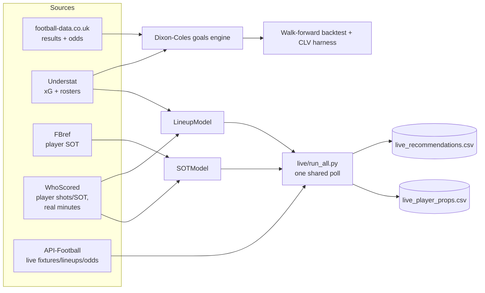

# ⚽ footymodel


A stats-first football betting research project: does **positive expected
value (ROI) vs. bookmaker closing odds** exist anywhere in these markets, and
if so, where exactly? Not "does this predict football well" — a model can be
accurate and still lose money once the market's own margin is priced in.

Every claimed edge here has been walk-forward backtested (never trained on
future data) and calibration-checked before being trusted. Most markets
tested show **no edge**, and that's reported just as loudly as the ones that
do — see [Results at a glance](#results-at-a-glance) and the full
[`RESULTS.md`](RESULTS.md).

## Table of contents

- [Results at a glance](#results-at-a-glance)
- [Core idea](#core-idea)
- [Architecture](#architecture)
- [Layout](#layout)
- [Setup](#setup)
- [Phase 1 usage](#phase-1-usage)
- [Betting tool — weekly workflow (Over/Under)](#betting-tool--weekly-workflow-overunder)
- [Phase A — lineup-aware model](#phase-a--lineup-aware-model-confirmed)
- [Phase B — live pipeline](#phase-b--live-pipeline-detection--paper-trade-not-execution)
- [Roadmap](#roadmap)
- [Testing](#testing)
- [License](#license)

## Results at a glance

| Market / feature | Verdict | Key number |
|---|---|---|
| Over/Under, 1X2 (goals model) | ❌ No edge | CLV ≈ −0.2%, yield ≈ −7% |
| Asian Handicap (all 7 leagues) | ❌ No edge | best config +2.05% yield but −1.52% CLV — the "positive yield, negative CLV" noise trap |
| Lineup-aware total-goals accuracy | ✅ Confirmed | pooled t = 3.04 across all big-5 leagues |
| Lineup-edge → live profit | ⏳ Untested | can only exist in the pre-kickoff window; live paper-trade starts when the season kicks off |
| Player shots/SOT calibration | ✅ Well-calibrated | gaps mostly within ±0.03, full PL + Bundesliga seasons |
| Player shots/SOT → live profit | ⏳ Untested | no historical odds archive reachable; live paper-trade only |

Full detail, per-league tables, and every rejected hypothesis (rest-days,
mid-tier lineup extension, etc.) are in [`RESULTS.md`](RESULTS.md).

## Core idea

Betting favorites gives a high hit rate and negative returns. We optimize for
**edge vs. the bookmaker's margin-stripped ("fair") probability**. Profit comes
from calibration + value detection + staking discipline, on top of a principled
statistical core (Dixon-Coles / Poisson).

## Architecture



One shared fetch per poll drives both live engines (goals + player props) —
see [Phase H](#roadmap) for why that matters on a 100-req/day free API tier.

## Layout

```
footymodel/
  config.py    # leagues, seasons, data source URLs, column maps
  data.py      # Phase 1 — download + normalize football-data.co.uk CSVs
data/
  raw/         # downloaded CSVs (gitignored)
  processed/   # normalized tidy table (gitignored)
```

## Setup

```bash
cd ~/footymodel
python3 -m venv .venv
. .venv/bin/activate
pip install -r requirements.txt
```

## Phase 1 usage

```bash
. .venv/bin/activate
python -m footymodel.data              # download + normalize default leagues/seasons
python -m footymodel.data --leagues E0 E1 N1 --seasons 2021 2022 2023 2024
```

Output: `data/processed/matches.parquet` — one tidy row per match.

## Betting tool — weekly workflow (Over/Under)

The recommender fits the model on all history and outputs O/U value bets with
fractional-Kelly stakes for upcoming fixtures, logging them for paper-trading.

```bash
. .venv/bin/activate
# Demo on the latest matchday in the dataset (grades vs actual results):
python -m footymodel.recommend --league E1

# Live use next season — supply current fixtures + odds:
#   fixtures.csv columns: home_team,away_team,odds_over25,odds_under25
python -m footymodel.recommend --league E1 --fixtures fixtures.csv
```

Every run appends to `data/processed/paper_trades.csv`. Team names must match
football-data.co.uk spellings (e.g. "Sheffield United", "Nott'm Forest").

> **HONEST STATUS — paper-trade only.** The goals/xG statistical model shows
> **no edge** vs. the market (`RESULTS.md`): O/U yield ~−7%, CLV ~−0.2%. The one
> confirmed exception is the **lineup-aware model** (Phase A below) — knowing the
> actual starting XI (attack + defence) measurably improves O/U prediction
> accuracy, replicated significantly across all 5 big-5 leagues (pooled t=3.04).
> That's an accuracy result, not a profit result yet — see Phase B.

## Phase A — lineup-aware model (CONFIRMED)

`players.py`'s `LineupModel` predicts total goals from the actual starting XI
(both attack AND defence ratings, not team averages) using scraped Understat
per-match rosters. This is the single model improvement that has held up under
rigorous cross-league testing in this project — see `RESULTS.md` for the full
big-5 confirmation (every league improved in the same direction, unlike an
earlier half-built version that didn't replicate).

```bash
python -m footymodel.understat                    # already run — big-5 xG cached
python scripts/build_players.py E0,SP1,D1,I1,F1    # scrape rosters (slow, cached)
python scripts/lineup_test.py E0,SP1,D1,I1,F1      # reproduce the t=3.04 confirmation
```

## Phase B — live pipeline (detection / paper-trade, not execution)

The closing line already prices lineups, so Phase A's edge can't be captured
in a backtest — it can only exist in the **live window** right after lineups
are confirmed (~20–40 min pre-kickoff, per API-Football's own docs) and before
bookmakers re-price. `footymodel/live/` watches upcoming big-5 fixtures,
detects confirmed lineups, runs the exact same `LineupModel` used in the
confirmed backtest, fetches best-price O/U odds, and logs a timestamped
recommendation. **No staking, no order placement — detection/paper-trade only.**

### Setup
1. Get an API-Football key: https://www.api-football.com/pricing (Free tier —
   100 req/day — is enough to watch a handful of fixtures/day; Pro is $19/mo
   for 7,500 req/day if you scale up). Claude cannot create this account for you.
2. Put the key in a local `.env` file at the repo root (gitignored, never
   committed): `API_FOOTBALL_KEY=your_key_here`. `live/client.py` loads it
   automatically.
3. League IDs are VERIFIED against a live key (2026-07-28) — all 5 correct:
   PL=39, La Liga=140, Bundesliga=78, Serie A=135, Ligue 1=61. Re-run
   `python -m footymodel.live.engine --verify-leagues` any time to re-check.
4. Run a poll (checks fixtures kicking off in the next 2h, logs any with
   confirmed lineups it hasn't seen before). `run_all.py` drives BOTH the
   goals/O-U engine and the player shots/SOT props engine off one shared
   fixtures+lineups fetch per poll (see below for why this matters) —
   `engine.py` also still runs standalone (goals only) for manual testing:
   ```bash
   python -m footymodel.live.run_all
   ```
   **CONFIRMED live constraint (Free tier):** fixture queries filtered by
   `league`+`season` are blocked for the current season ("try from 2022 to
   2024"). The engine works around this by querying by DATE ONLY (works fine)
   and filtering by league id client-side — already fixed and verified working.
   There's also a separate per-minute rate limit (not just the 100/day quota);
   the client retries with backoff automatically.
5. **Cron schedule installed** (`crontab -l` to view): every 20 minutes,
   10:00–22:59 daily —
   ```
   */20 10-22 * * * cd /Users/tanamsethi/footymodel && /Users/tanamsethi/footymodel/.venv/bin/python -m footymodel.live.run_all >> /Users/tanamsethi/footymodel/data/logs/live_poll.log 2>&1
   ```
   **Why `run_all.py` and not two separate cron entries for goals + props:**
   each watcher independently fetching fixtures + lineups would roughly double
   API-Football usage for identical data — the ~78 baseline requests/day below
   would become ~156 just for fixture lookups, already over the 100/day
   Free-tier quota before any lineup/odds calls. `run_all.py` fetches once per
   poll and shares it across both engines, so running both costs the same as
   running one.
   **Why not every 5 min around the clock:** the lineup window (20-40 min) only
   needs ≤20min polling to guarantee a catch, but 24/7 polling at that rate would
   burn 576 requests/day against the 100/day Free-tier quota. Concentrating ~39
   polls/day (78 baseline requests) into realistic match hours leaves headroom
   for the extra lineup+odds calls each detected fixture adds. Check
   `data/logs/live_poll.log` for output; nothing to log yet in late July (big-5
   season starts mid-August) — "No new confirmed-lineup fixtures this poll" is
   the correct, expected output until then. Adjust the cron window once you
   know actual kickoff times, or bump to Pro ($19/mo, 7,500 req/day) to poll
   more aggressively/around the clock.

Goals recommendations log to `data/processed/live_recommendations.csv`; player
shots/SOT props log to `data/processed/live_player_props.csv`. Every fixture is
logged at most once per engine (dedup via `data/processed/live_seen_fixtures.json`,
shared by `run_all.py` across both engines; `shots_engine.py` also has its own
`live_props_seen_fixtures.json` for standalone runs).

### Before spending API quota — dry-run tests (no key needed)
```bash
python scripts/live_dryrun.py        # goals engine only
python scripts/shots_live_dryrun.py  # props engine only
python scripts/run_all_dryrun.py     # both, via run_all.py — asserts lineups
                                     # are fetched ONCE and shared, not per-engine
```
All three run the pipeline (team/player matching, lineup parsing, best-price
odds selection, EV calc) against a mocked API response built from real
historical rosters. Already run and passing — use them again after any code
change to the `live/` package.

## Roadmap

- [x] Phase 0 — scaffold
- [x] Phase 1 — data pipeline (`data.py`)
- [x] Phase 2 — Dixon-Coles goals engine (`model.py`)
- [x] Phase 2b — Understat xG integration (`understat.py`)
- [x] Phase 3 — value + backtest harness + CLV (`backtest.py`) → **no edge**
- [x] Phase 4 — O/U market-aware strategy + sweep (`strategy.py`)
- [x] Phase 5 — staking / bankroll (`staking.py`)
- [x] Phase 6 — recommender / paper-trade (`recommend.py`)
- [x] Phase A — lineup-aware model (`players.py`) → **confirmed edge, t=3.04**
- [x] Phase B — live lineup pipeline (`live/`) → built, dry-run validated,
      **needs a real API-Football key to run live** (user action required)
- [x] Phase C — Asian Handicap, all 7 leagues (`model.py` `predict_ah`,
      `scripts/ah_backtest.py`) → **no edge** (best config: +2.05% yield but
      CLV −1.52%, the "positive yield/negative CLV = noise" trap). Mid-tier
      lineup extension via FBref researched and confirmed not viable (no
      per-player xG for Championship/Eredivisie) — see RESULTS.md.
- [x] Phase D — Player shots-on-target via FBref (`footymodel/fbref.py`,
      `scripts/fbref_ingest_batch.py`, `scripts/fbref_sot_calibration_test.py`)
      → **well-calibrated on one PL season** (gaps within ±0.03 in populated
      buckets). FBref blocks direct requests; scraped via the browser's own
      `fetch()`. Real rate limit under sustained volume (HTTP 429 ~600
      requests/session) — one clean season done, second deferred until it
      clears. See RESULTS.md Phase D.
- [x] Phase E — Player shots + SOT via WhoScored, real per-player minutes
      (`footymodel/whoscored.py`, `scripts/whoscored_calibration_test.py`)
      → **well-calibrated, full 380/380 PL 2023/24 season** (gaps mostly
      within ±0.03 in populated buckets). First version using each player's
      actual substitution minutes instead of a flat 85-minute assumption.
      Hit a real WhoScored rate limit mid-scrape (confirmed properly: a
      previously-successful match started failing too), same pattern as the
      FBref 429s in Phase D - waited it out and finished the season once it
      cleared. See RESULTS.md Phase E.
- [x] Phase F — Home/away venue factor for shots/SOT → **confirmed real**
      (~26%/22% higher home shots/SOT rate league-wide on PL). Integrated
      into `LineupModel`/`fbref.SOTModel`. Rest-days/fixture-congestion also
      tested — no signal, not added. See RESULTS.md Phase F.
- [x] Phase G — Second-league robustness check (Bundesliga) → venue effect
      and calibration **both replicate with zero re-tuning** (Bundesliga home
      edge even larger: +28%/29%). `whoscored.py` generalized to support
      multiple leagues. See RESULTS.md Phase G.
- [x] Phase H — Merged live cron entry point (`live/run_all.py`) → goals and
      player-props engines now share ONE fixtures+lineups fetch per poll
      instead of two independent ones, which would have doubled API-Football
      usage past the Free-tier daily quota. Also fixed a latent dedup bug in
      `shots_engine.py` (it had none — would have logged duplicate prop rows
      every poll before kickoff).
- [x] Phase I — Player-prop odds wired into `shots_engine.py`, same
      API-Football key as everything else (no new vendor). No historical
      odds archive is reachable (Free tier blocks past-season lookups —
      confirmed live), so this is **forward paper-trade only**: real EV data
      starts accumulating once the season kicks off. Verified against a real
      fixture that only two bet markets ("Player Shots On Target", "Home/Away
      Player Shots") reliably use a clean per-player "{name} - N+" line
      format — other shots-named markets seen in practice are team totals or
      single-price outrights and are deliberately not parsed. These are
      one-sided lines with no Over/Under complement, so EV is the **naive**
      `model_prob * odd - 1`, not margin-adjusted. Considered (and rejected)
      third-party historical player-prop odds vendors — The Odds API is
      paid-plan-only for this, OddsPapi's free-tier/coverage claims couldn't
      be verified against real docs.

## Testing

Most of this project's real correctness checks are backtests, not unit
tests — a walk-forward calibration table catches more than an assert would.
But a handful of non-trivial, data-independent logic paths (Asian Handicap
settlement, the live player-prop odds parser) do have standalone pure-Python
checks, run on every push via [GitHub Actions](.github/workflows/ci.yml):

```bash
python scripts/ah_settlement_test.py
python scripts/props_odds_parse_test.py
```

Everything under `live/` additionally has a dry-run mode (mocked API
responses, no key or quota spent) — see
[Before spending API quota](#before-spending-api-quota--dry-run-tests-no-key-needed) above.

## License

Copyright © 2026 Tanam Sethi. All rights reserved. No license is granted to
copy, modify, or redistribute this code or its contents.
